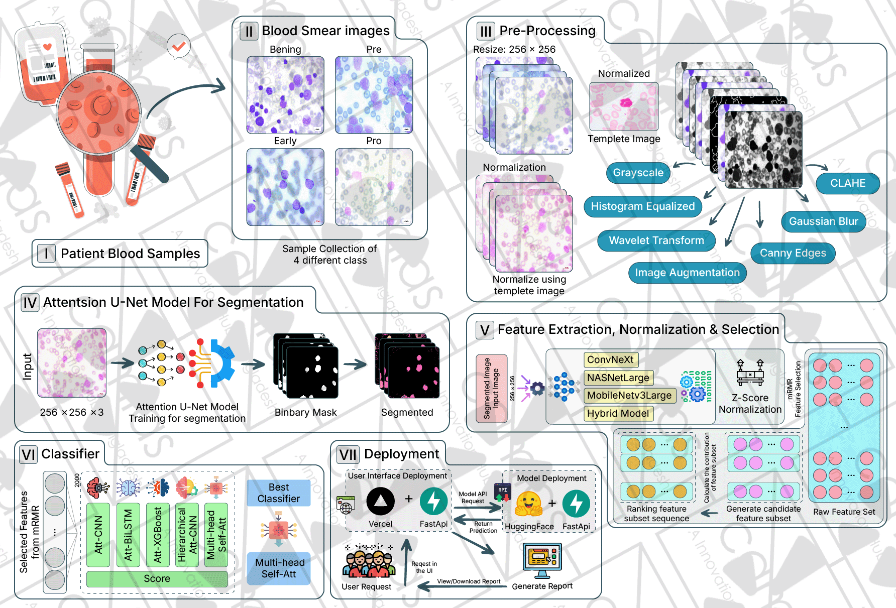
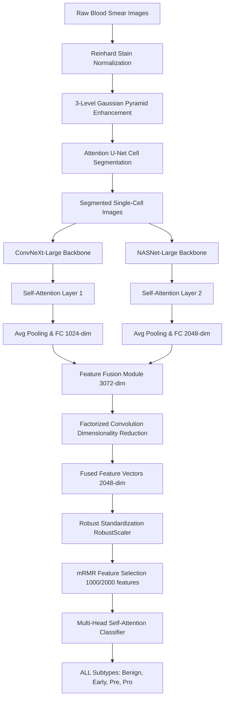

# HybridCN-NAS: Precision acute leukemia diagnosis using hybrid neural architecture search and Multi-Head Self-Attention

A high-performance, automated deep learning framework for the classification of Acute Lymphoblastic Leukemia (ALL) subtypes from peripheral blood smear images. This repository implements a novel hybrid feature extraction architecture (**HybridCN-NAS**) combining ConvNeXt-Large and NASNet-Large backbones with custom self-attention modules, coupled with a Multi-Head Self-Attention classifier.

🌐 **Project Live Deployment**: [https://leukemia.francisrudra.com/](https://leukemia.francisrudra.com/)

---

## 🔬 Methodology Overview

The classification pipeline is designed to process raw blood smear images, isolate individual cells, extract high-dimensional semantic features, select the most informative features, and perform multi-class classification.

### 🖼️ System Workflow





### 1. Image Preprocessing & Cell Segmentation

- **Stain Normalization**: Implements Reinhard stain normalization to align color distributions across varying slide preparation styles.
- **Image Enhancement**: Enhances cell structures using a 3-level Gaussian pyramid for multi-scale edge and contrast stretching, followed by noise reduction.
- **Attention U-Net Segmentation**: Leverages an Attention U-Net model with gate-based attention mechanisms to segment individual white blood cells from the background, outputting cropped single-cell regions.

### 2. Hybrid Feature Extraction (HybridCN-NAS)

The core feature extractor uses a dual-backbone configuration:

- **ConvNeXt-Large Backbone**: Extracted intermediate features are passed through a custom self-attention layer, global average pooled, and projected to a 1024-dimensional space.
- **NASNet-Large Backbone**: Extracted intermediate features are passed through a custom self-attention layer, global average pooled, and projected to a 2048-dimensional space.
- **Feature Fusion**: A dedicated `FeatureFusionModule` projects and concatenates the features (forming a 3072-dimensional vector), followed by multi-layer projection and layer normalization.
- **Factorized Convolution**: A two-stage linear reduction block with ReLU and Batch Normalization (`FactorizedConv`) projects the fused representation into a final 2048-dimensional embedding.

### 3. Normalization & Feature Selection

- **Robust Standardization**: Employs `RobustScaler` to center and scale the high-dimensional feature vectors, mitigating the influence of outliers.
- **mRMR Selection**: Applies the minimum Redundancy Maximum Relevance (mRMR) algorithm to select the top informative feature subset (e.g., 1000 or 2000 features), reducing computational complexity while retaining critical diagnostic information.

### 4. Classification Network

Features are passed to a **Multi-Head Self-Attention Classifier** (`MultiHeadSelfAttentionClassifier`) which models relationships between feature elements to predict the final disease category.

---

## 📂 Dataset Information

The model is trained and validated on the **Taleqani Hospital ALL dataset**:

- **Total Samples**: 3,256 peripheral blood smear images.
- **Input Size**: Normalized and cropped to $224 \times 224$ pixels (RGB).
- **Target Classes**:
    1. `Benign`: Benign Hematogones
    2. `Early`: Early pre-B ALL
    3. `Pre`: Pre-B ALL
    4. `Pro`: Pro-B ALL

Dataset access link: https://leukemia.francisrudra.com/resources

Direct Link: https://www.kaggle.com/datasets/mehradaria/leukemia

---

## 📂 Repository Structure

The experimental pipeline is organized across 13 Jupyter notebooks:

- [Segmentation.ipynb](./Segmentation.ipynb) - Reinhard stain normalization, multi-scale Gaussian enhancement, and Attention U-Net cell segmentation.
- [Feature_Extraction.ipynb](./Feature_Extraction.ipynb) - Defines backbones, self-attention, fusion modules, and extracts 2048-dimensional features.
- [Normalization.ipynb](./Normalization.ipynb) - Feature standardization comparisons (RobustScaler vs MinMaxScaler).
- [Feature_Selection.ipynb](./Feature_Selection.ipynb) - Feature selection using mRMR, LassoCV, PCA, and Chi-Square.
- [Model_Comparison.ipynb](./Model_Comparison.ipynb) - Comparative evaluation of classifiers: Multi-Head Self-Attention, AttBiLSTM, AttCNN, HierarchicalAttCNN, and XGBoost.
- [Ablatuion_Study.ipynb](./Ablatuion_Study.ipynb) - Ablation study of model sub-modules (removing attention mechanisms, comparing single backbones).
- [Optimizer_Comparison.ipynb](./Optimizer_Comparison.ipynb) - Compares performance under Adam, AdamW, SGD, and RMSprop.
- [Learning_Rate.ipynb](./Learning_Rate.ipynb) - Optimization curves for different base learning rates.
- [Batch_Size.ipynb](./Batch_Size.ipynb) - Evaluates impact of batch sizes (8, 16, 32, 64) on convergence.
- [Epoch.ipynb](./Epoch.ipynb) - Epoch-wise accuracy and validation loss curves.
- [Feature_Comparison.ipynb](./Feature_Comparison.ipynb) - Statistical and comparative analysis of extracted features.
- [UMAP.ipynb](./UMAP.ipynb) - UMAP dimensionality reduction and high-dimensional visualization.

---

## 📈 Experimental Performance

The HybridCN-NAS architecture paired with the Multi-Head Self-Attention classifier achieves state-of-the-art diagnostic metrics:

| Metric       | Performance Value |
| :----------- | :---------------: |
| **Accuracy** |    **99.92%**     |
| **AUC**      |    **99.64%**     |
| **F1-Score** |    **96.14%**     |
| **MCC**      |    **95.06%**     |

---

## ⚙️ Dependencies & Installation

This project requires Python 3.8+ and PyTorch (compatible with CUDA and Apple Silicon MPS). All software packages are managed inside [requirements.txt](./requirements.txt).

1. Clone this repository:

    ```bash
    git clone https://github.com/camlas/leukemia-HybridCN-NAS.git
    cd leukemia-HybridCN-NAS
    ```

2. Install the required dependencies:
    ```bash
    pip install -r requirements.txt
    ```

---

## 🚀 Usage Guide

For replication of results, execute the notebooks in the following sequential order:

1. **Cell Segmentation**:
   Place raw Taleqani Hospital dataset under `dataset/Raw/` and run [Segmentation.ipynb](./Segmentation.ipynb) to segment cells. Output images are saved in `dataset/Segmented/`.
2. **Feature Extraction**:
   Run [Feature_Extraction.ipynb](./Feature_Extraction.ipynb) to pass segmented cells through the Hybrid model and extract 2048-dimensional features. Output features are written to `Visual/NASNetLarge/feature_extract_Hybrid_features.csv`.
3. **Feature Normalization**:
   Run [Normalization.ipynb](./Normalization.ipynb) to standardize the feature matrix using `RobustScaler`.
4. **Feature Selection**:
   Run [Feature_Selection.ipynb](./Feature_Selection.ipynb) to perform mRMR feature selection.
5. **Model Comparisons & Hyperparameter Optimization**:
   Run [Model_Comparison.ipynb](./Model_Comparison.ipynb) to evaluate different classifier backbones, and execute the tuning notebooks (`Learning_Rate.ipynb`, `Batch_Size.ipynb`, `Epoch.ipynb`, `Optimizer_Comparison.ipynb`, `Ablatuion_Study.ipynb`) to explore hyperparameter influences.
6. **Clustering & Visualizations**:
   Run [UMAP.ipynb](./UMAP.ipynb) to generate low-dimensional cluster maps.

---

## 👥 Researchers & Authors

The research and development of the leukemia subtype classification framework were carried out by the following investigators:

### Francis Rudra D Cruze

- **Affiliation**: MS Student & Research Assistant at CAMLAs, Department of Computer Science and Engineering, Faculty of Science and Information Technology, East West University.
- **Role**: Writing, Formal Analysis, Data Acquisition, Model & Platform Development.
- **Expertise**: Medical Image Analysis, Computer Vision, Deep Learning.
- **Contact**: francisrudra@gmail.com

### Dr. S M Hasan Mahmud (Corresponding Author)

- **Affiliation**: Associate Professor, Department of Software Engineering, Faculty of Science and Information Technology, Daffodil International University.
- **Role**: Supervision, Methodology, Conceptualization.
- **Expertise**: Computer Vision, Bioinformatics, Sequence Analysis.
- **Contact**: drhasan.swe@diu.edu.bd

### Md. Faruk Hosen

- **Affiliation**: Lecturer, Department of Computing and Information Systems, Faculty of Science and Information Technology, Daffodil International University.
- **Role**: Investigation, Resources Management.
- **Expertise**: Machine Learning, Deep Learning, Bioinformatics.
- **Contact**: faruk.cis@diu.edu.bd

### Dr. Goh Kah Ong Michael (Corresponding Author)

- **Affiliation**: Associate Professor, Faculty of Information Science & Technology, Multimedia University.
- **Role**: Supervision, Funding Acquisition.
- **Contact**: michael.goh@mmu.edu.my

### Dr. Hosney Jahan

- **Affiliation**: Assistant Professor, Department of Computer Science & Engineering, Faculty of Science and Information Technology, East West University.
- **Role**: Writing - Review & Editing.
- **Expertise**: Machine Learning, Artificial Intelligence, Software Testing.
- **Contact**: hosney.jahan@ewubd.edu

---

## 📝 Citations

If you make use of this code, the dataset, or the models in your research, please cite them as follows:

```text
D Cruze FR, Mahmud SMH, Hosen MF, Michael GKO, Jahan H. 2026. Leukemia Classification Using HybridCN-NAS. PeerJ Computer Science, [Volume]:[Pages] DOI: [Paper DOI].
```

To cite the code repository directly (archived version via Zenodo):

```text
D Cruze FR, Mahmud SMH, Hosen MF, Michael GKO, Jahan H. 2026. camlas/leukemia-HybridCN-NAS: Publication Release. Zenodo. Available at https://github.com/camlas/leukemia-HybridCN-NAS (accessed 22 June 2026) DOI: 10.5281/zenodo.[Identifier]
```

---

## 📄 License & Contribution Guidelines

### License

This project is licensed under the terms of the **MIT License**. See the [LICENSE](./LICENSE) file for the full license text.

### Contributions

We welcome community contributions, bug reports, and suggestions.

1. Fork the repository.
2. Create a feature branch: `git checkout -b feature/your-feature`.
3. Commit your changes with descriptive messages.
4. Push to the branch: `git push origin feature/your-feature`.
5. Open a Pull Request detailing the enhancements or bug fixes.
